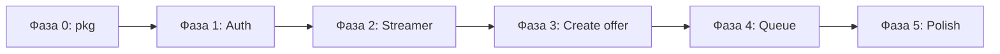

# План до MVP

Документ описывает минимальный набор функциональности, чтобы закрыть основной сценарий:
**зритель находит стримера → предлагает видео → стример видит очередь и обрабатывает офферы**.

Полная спецификация — в [AGENTS.md](../AGENTS.md). Здесь — только то, что нужно для первой рабочей версии.

---

## MVP: определение готовности

MVP считается готовым, когда через API (curl / Postman / простой фронт) можно пройти цепочку:

1. Зарегистрироваться и войти (access + refresh токены).
2. Переключить роль на `streamer`.
3. Найти стримера по `username` и увидеть, принимает ли он офферы.
4. Отправить ссылку на видео в предложку стримера.
5. Стример получает очередь `pending`, меняет статус на `watched` / `skipped` / `rejected`.
6. Отправитель видит статус своих офферов и может отозвать `pending`.

Плюс: `/healthz` отвечает, миграции накатываются, критичные пути покрыты тестами.

---

## Текущее состояние

| Компонент | Статус |
|---|---|
| Схема БД (`00001_init.sql`) | ✅ Готова |
| Доменные типы и ошибки | ✅ Готовы |
| Конфиг, логи, graceful shutdown | ✅ Готовы |
| HTTP: error handler, healthz, каркас роутов | ✅ Готовы |
| Репозитории (SQL) | ❌ Нет |
| Сервисный слой | ❌ Нет |
| Auth (JWT, hash, middleware) | ❌ Нет |
| Handlers (кроме healthz) | ❌ Заглушки 501 |
| Video resolver (oEmbed) | ❌ Нет |
| Тесты | ❌ Нет |

---

## В MVP входит

### Auth и профиль
- `POST /auth/register`, `/auth/login`, `/auth/refresh`, `/auth/logout`
- `GET /me`, `PATCH /me` (display_name, avatar_url, смена роли на streamer)
- argon2id, JWT access + opaque refresh с ротацией

### Стримеры (публично)
- `GET /streamers/:username` — профиль + `accepting_offers`
- `GET /streamers` — список стримеров с cursor-пагинацией (без полнотекстового поиска на MVP: сортировка по `created_at`, опциональный фильтр по prefix username)

### Настройки стримера
- `GET /me/settings`, `PATCH /me/settings` — минимум: `accepting_offers`
- `streamer_settings` создаётся при первом переключении роли в `streamer`

### Офферы
- `POST /streamers/:username/offers` — создание с нормализацией URL, дедупом, SSRF-проверкой
- `GET /me/offers` — очередь стримера (`?status=&limit=&cursor=`)
- `PATCH /me/offers/:id` — смена статуса (`pending → watched|skipped|rejected`)
- `DELETE /me/offers/:id` — удаление оффера стримером
- `GET /me/sent`, `DELETE /me/sent/:id` — лента отправителя и отзыв `pending`

### Метаданные видео
- Резолв через oEmbed: **YouTube** (обязательно для MVP)
- Остальные провайдеры: принимаем ссылку как `provider = other`, метаданные пустые
- Таймаут 3s, ошибка резолва не блокирует создание оффера

### Инфраструктура
- Rate limit на `/auth/*` и `POST .../offers`
- `internal/pkg/uuid` — генерация uuid v7 для id
- Unit-тесты сервисов, интеграционные тесты repo + HTTP на testcontainers

---

## За пределами MVP

Оставляем на потом (см. также AGENTS.md):

| Фича | Почему не в MVP |
|---|---|
| OAuth (Twitch и др.) | Отдельный большой блок |
| oEmbed Twitch / VK | YouTube покрывает основной кейс; остальное — с голой ссылкой |
| `min_account_age` enforcement | Дефолт 0, логику включим позже |
| `allow_anonymous` | В MVP все офферы только от авторизованных |
| SSE / live-обновление очереди | Фронт polling'ом |
| Модерация, блок-листы | Не нужны для проверки гипотезы |
| Платные приоритеты | — |
| Полнотекстовый поиск стримеров | Prefix-match достаточно |

---

## Фазы реализации

### Фаза 0 — Подготовка
**Цель:** инфраструктура для разработки и тестов.

- [ ] `internal/pkg/uuid` — uuid v7
- [ ] `internal/pkg/hash` — argon2id (hash + verify)
- [ ] `internal/pkg/jwt` — sign/parse access token
- [ ] `internal/pkg/pagination` — encode/decode cursor (`created_at` + `id`)
- [ ] `.golangci.yml` + зависимости (`validator`, testcontainers)
- [ ] Хелпер для интеграционных тестов (Postgres в testcontainers, migrate up)

**Критерий:** `make test` и `make lint` проходят (пустые пакеты ок).

---

### Фаза 1 — Auth (вертикальный срез)
**Цель:** регистрация, вход, refresh, logout, `/me`.

```
transport/auth.go, middleware/auth.go
service/auth.go          ← интерфейсы UserRepo, RefreshTokenRepo
repo/user.go, refresh_token.go
```

- [ ] `UserRepo`: Create, GetByID, GetByEmail, GetByUsername, Update
- [ ] `RefreshTokenRepo`: Create, GetByHash, MarkUsed
- [ ] `AuthService`: Register, Login, Refresh, Logout
- [ ] Middleware `RequireAuth`
- [ ] Handlers: `/auth/*`, `GET /me`, `PATCH /me`
- [ ] Unit-тесты `AuthService`
- [ ] Интеграционный тест: register → login → /me → refresh → logout

**Критерий:** curl-скрипт auth-flow работает end-to-end.

---

### Фаза 2 — Стример: роль и настройки
**Цель:** пользователь становится стримером, управляет приёмом офферов.

```
service/user.go
repo/streamer_settings.go
transport/me.go, streamers.go
```

- [ ] `StreamerSettingsRepo`: Create, GetByUserID, Update
- [ ] `UserService`: UpdateProfile (роль → streamer создаёт settings), GetSettings, UpdateSettings
- [ ] Middleware `RequireStreamer`
- [ ] Handlers: `PATCH /me` (роль), `/me/settings`, `GET /streamers/:username`, `GET /streamers`
- [ ] Unit-тесты смены роли и settings

**Критерий:** viewer → streamer, settings видны на публичном профиле.

---

### Фаза 3 — Офферы: создание
**Цель:** зритель отправляет видео стримеру.

```
service/offer.go, video/url.go, video/resolver.go
repo/offer.go
transport/offers.go
```

- [ ] Нормализация URL (YouTube: utm, youtu.be, tаймкоды)
- [ ] SSRF-валидация (только http/https, без private IP)
- [ ] `VideoResolver` interface + YouTube oEmbed implementation
- [ ] `OfferRepo`: Create, GetByID, ExistsPendingDuplicate
- [ ] `OfferService`: Create (проверка accepting_offers, дедуп → 409)
- [ ] Handler: `POST /streamers/:username/offers`
- [ ] Rate limiter на создание офферов
- [ ] Unit-тесты: normalize, dedup, SSRF, resolver fallback

**Критерий:** оффер создаётся, дубль в pending → 409, выключенный приём → 409.

---

### Фаза 4 — Офферы: очередь и статусы
**Цель:** стример работает с очередью, отправитель видит свои офферы.

- [ ] `OfferRepo`: ListByStreamer (cursor), ListBySender (cursor), UpdateStatus, Delete
- [ ] `OfferService`: ListQueue, UpdateStatus (валидация переходов), Delete, ListSent, RevokeSent
- [ ] Handlers: `GET/PATCH/DELETE /me/offers`, `GET/DELETE /me/sent`
- [ ] Unit-тесты переходов статуса и прав доступа (403 на чужой оффер)
- [ ] Интеграционный тест полного flow: create → list → watched

**Критерий:** полный сценарий из раздела «MVP: определение готовности» проходит через API.

---

### Фаза 5 — Полировка MVP
**Цель:** готовность к деплою и сопровождению.

- [ ] Rate limit на `/auth/*`
- [ ] `docs/api-examples.md` — curl-примеры всех эндпоинтов
- [ ] Покрытие интеграционными тестами всех handlers
- [ ] README: quick start (docker, migrate, run)
- [ ] Прогон ручного smoke-теста по чеклисту ниже

---

## Порядок зависимостей



Каждая фаза — mergeable increment: после фазы 1 уже можно регистрироваться,
после фазы 3 — отправлять офферы (если стример создан вручную в БД или через фазу 2).

---

## Smoke-чеклист MVP

```bash
# 0. Поднять БД и миграции
docker compose up -d db
cp .env.example .env
make migrate-up
make run
```

- [ ] `GET /healthz` → `{ "status": "ok", "db": "up" }`
- [ ] Register streamer A + login → tokens
- [ ] `PATCH /me` `{ "role": "streamer" }` → settings созданы
- [ ] Register viewer B + login
- [ ] `GET /streamers/:username` → `accepting_offers: true`
- [ ] `POST /streamers/:username/offers` `{ "url": "https://youtube.com/watch?v=..." }` → 201
- [ ] Повтор того же URL → 409 `offer_duplicate`
- [ ] Streamer A: `GET /me/offers?status=pending` → оффер в списке
- [ ] `PATCH /me/offers/:id` `{ "status": "watched" }` → 200
- [ ] Viewer B: `GET /me/sent` → статус `watched`
- [ ] `POST /auth/refresh` → новая пара токенов
- [ ] `POST /auth/logout` → refresh больше не работает

---

## Оценка объёма

| Фаза | Примерно | Комментарий |
|---|---|---|
| 0 | 0.5–1 день | Утилиты + test infra |
| 1 | 2–3 дня | Самая объёмная: auth + repos + тесты |
| 2 | 1 день | Небольшой слой поверх фазы 1 |
| 3 | 2–3 дня | URL logic + oEmbed + create offer |
| 4 | 1–2 дня | CRUD очереди, mostly wiring |
| 5 | 1 день | Rate limit, docs, README |
| **Итого** | **~8–11 дней** | Один разработчик, без фронта |

---

## Следующий шаг

Начинаем с **Фазы 0**: `internal/pkg/uuid`, `hash`, `jwt`, `pagination` и testcontainers-хелпер.
